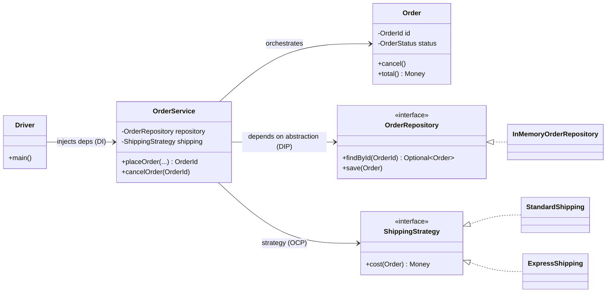

# Module 1 — Advanced OOP Principles & SOLID

> Goal: not to recite definitions, but to recognize the *specific shapes* SOLID violations
> take in an LLD interview, and to make the remedy a reflex.

Runnable code for this module: `src/main/java/com/ultimatelld/module01solid/`
Run it: `./gradlew run -Pdriver=com.ultimatelld.theory.module01solid.driver.Driver`

---

## 1.1 Encapsulation — the root of all SOLID

SOLID is impossible to satisfy on top of "data bags + procedural services". An object owns
its invariants: outside code may *request* state changes but may never *force* an inconsistent
state.

Three interview-grade habits (see `common/Money.java`, `entity/Order.java`):
1. **Money as `long` minor units**, never `double` (floating-point rounding is an instant red flag).
2. **Defensive copies** on collection getters (`List.copyOf`) — returning the live list breaks encapsulation.
3. **Fail-fast constructors** — an object can never exist in an invalid state.

## 1.2 Rich vs. Anemic domain models

| | Anemic (anti-pattern) | Rich (target) |
|---|---|---|
| Entity | Getters/setters only | State **+** behavior enforcing invariants |
| Business logic | Lives in a fat `Service` | Lives in the entity; service *orchestrates* |
| Risk | Logic duplicated; invariants violable | Logic centralized; object always valid |

**Litmus test:** if entities have only getters/setters and a `*Service`/`*Manager` holds all the
`if` statements, the model is anemic. See `entity/Order.java` — `pay()`, `ship()`, `cancel()`,
and `total()` are behavior on the entity; `OrderStatus.canTransitionTo` keeps the transition
rule in exactly one place.

## 1.3 SOLID — LLD-specific violations & remedies

### S — Single Responsibility
One *axis of change* per class. A class name containing "And" or a god-`*Manager`/`*Util` is the
classic smell. We split persistence (`OrderRepository`), domain rules (`Order`), and orchestration
(`OrderService`) along separate axes.

### O — Open/Closed
Replace an `if/else`/`switch` over a type or rule with **polymorphism**. See `strategy/ShippingStrategy`
with `StandardShipping` / `ExpressShipping`. Adding `DroneShipping` = a new class, **zero edits**
elsewhere. This is the "add a feature with zero modification" constraint.

### L — Liskov Substitution
Subtypes must be substitutable without surprising callers. Avoid the "refused bequest" (subclass
throws on an inherited method, e.g. `Penguin extends Bird { fly() { throw ... } }`). Model behavior,
not taxonomy — segregate capability interfaces. Rule: subtypes may *weaken preconditions* and
*strengthen postconditions*, never the reverse.

### I — Interface Segregation
No client depends on methods it doesn't use. Split fat interfaces into role interfaces so no
implementer is forced to stub `throw new UnsupportedOperationException()`.

### D — Dependency Inversion
High-level modules depend on abstractions, not concretes. `OrderService` depends on the
`OrderRepository` **interface** (owned by the domain layer); `InMemoryOrderRepository`
(infrastructure) implements it. The dependency arrow points *inward* toward the domain. This is
why the Repository layer and constructor DI are mandatory.

## 1.4 The layered skeleton (reused in every Section 2 problem)

- **Entities** hold invariants · **Service** orchestrates (load → mutate via domain method → save)
  · **Repository** abstracts persistence · **Driver** is the only place that knows concrete types.
- Concurrency note: the entity is intentionally *not* thread-safe; the **service** serializes
  state transitions per order id via lock striping (`ConcurrentHashMap<OrderId, ReentrantLock>`).
  The driver proves this: 50 threads racing to cancel one order → exactly 1 success, 49 rejected.

## 1.5 Mental checklist (use in every design)

- [ ] Are my entities **rich** (behavior + invariants) or accidentally **anemic**?
- [ ] Does any class have **more than one axis of change**? (SRP)
- [ ] Is there a `switch`/`if-else` over a type a new feature would force me to edit? → Strategy/Factory (OCP)
- [ ] Does any subtype **throw on** or **weaken** an inherited contract? (LSP)
- [ ] Is any implementer forced to stub methods it doesn't need? → split the interface (ISP)
- [ ] Does any service `new` a concrete dependency or import an infra class? → inject an interface (DIP)
- [ ] Is money a `long` (minor units)? Are collection getters defensively copied?
