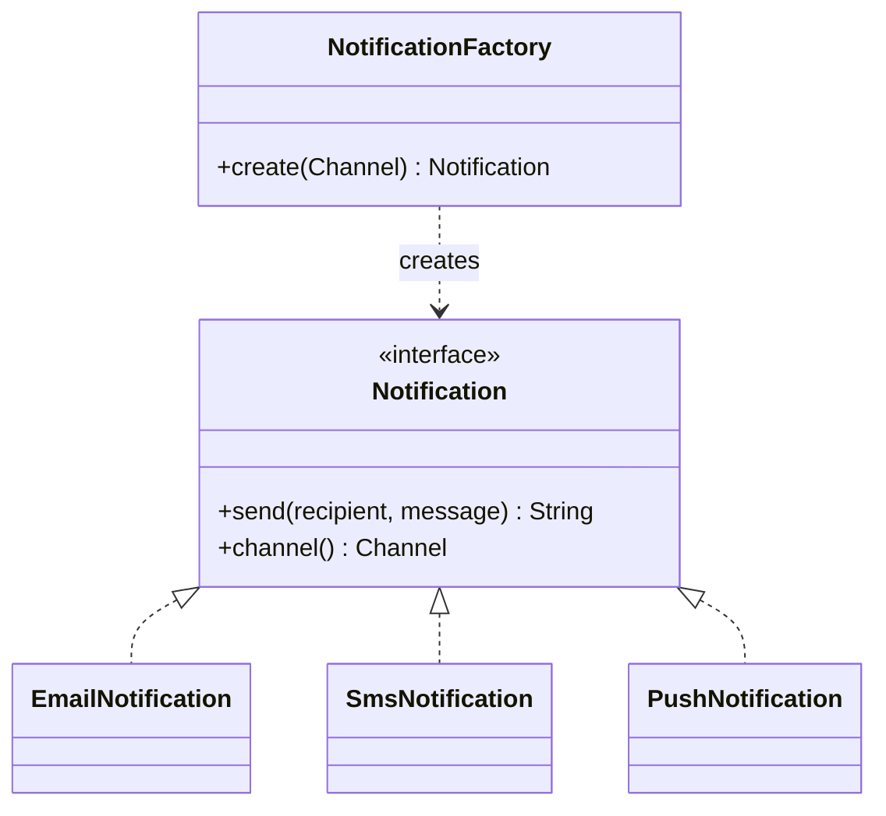
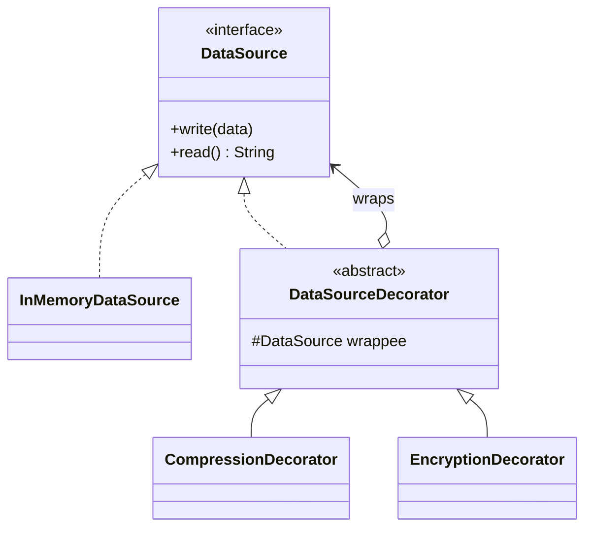
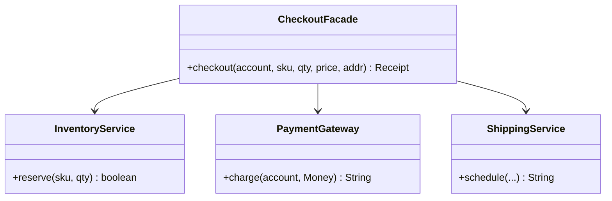
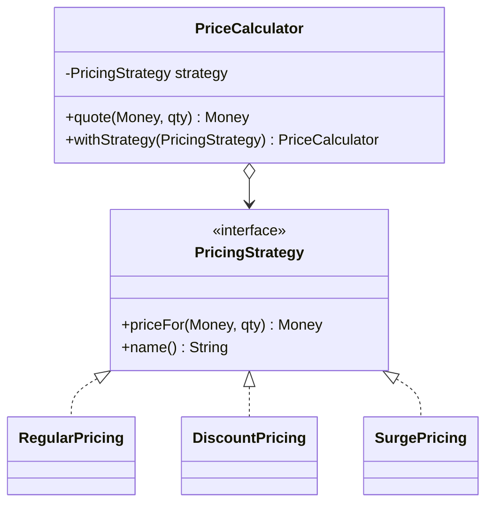
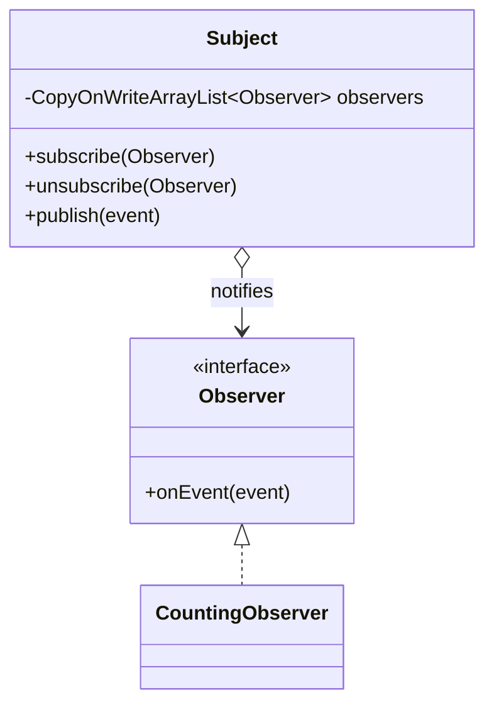
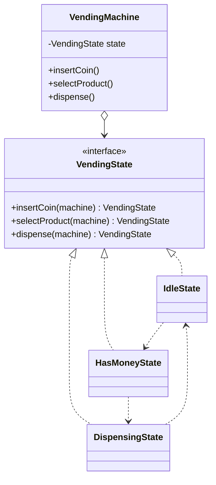

# Module 2 — Core Design Patterns

> Goal: recognize which Gang-of-Four pattern a problem is *asking for*, implement it the
> idiomatic Java way, and know the one failure mode an interviewer probes for.

Runnable code for this module: `src/main/java/com/ultimatelld/module02patterns/`
Run it: `./gradlew run -Pdriver=com.ultimatelld.theory.module02patterns.driver.Driver`

Every pattern below is wired and exercised by the `driver/Driver` composition root, including
two concurrency demos (thread-safe Singleton + Observer driven from an `ExecutorService`).

---

## Creational

### 2.1 Factory — `creational/NotificationFactory`

**Intent:** centralize object creation behind one method so callers depend on a product
*interface*, never on concrete classes.



**When (system design):** any time you have a product *family* selected by config/enum/request
(channels, parsers, storage backends, payment providers) and want a new variant to be "add a
class, touch one switch" (OCP).
**Pitfall:** letting the factory grow into a god-class that also *configures* and *wires*
products. Keep it to selection + instantiation; push wiring to the composition root.
**Code:** `creational/NotificationFactory.java`, `creational/Notification.java`

### 2.2 Builder — `creational/HttpRequest`

**Intent:** construct a complex immutable object step-by-step, with all cross-field validation
in `build()`, instead of a telescoping constructor or a half-built mutable object.

```mermaid
classDiagram
    class HttpRequest {
        -Method method
        -String url
        -Map headers
        -String body
        -int timeoutMillis
        +builder(Method, url) Builder
    }
    class Builder {
        +header(k, v) Builder
        +query(k, v) Builder
        +body(s) Builder
        +timeoutMillis(int) Builder
        +build() HttpRequest
    }
    HttpRequest +-- Builder
    Builder ..> HttpRequest : build()
```

**When (system design):** objects with many optional fields and invariants spanning fields
(e.g. "GET must not carry a body", "url must be absolute"). The result is immutable and
shareable across threads with no synchronization.
**Pitfall:** validating in the individual setters instead of in `build()` — a setter cannot see
cross-field rules, and partial validation lets an inconsistent builder slip through. Validate
once, in `build()`.
**Code:** `creational/HttpRequest.java`

### 2.3 Singleton — `creational/FeatureRegistry` (+ three idioms)

**Intent:** exactly one instance with a global access point, created thread-safely.

Three idioms are shown; **prefer the holder idiom or the enum**:

| Idiom | File | Verdict |
|---|---|---|
| Initialization-on-demand **holder** | `HolderSingleton` | Recommended — lazy, thread-safe, zero locks. JVM class-init guarantees correctness. |
| **Enum** | `EnumSingleton` | Recommended — safe against reflection and serialization attacks; most concise. |
| **Double-checked locking** (`volatile`) | `DoubleCheckedSingleton` | Legacy/ceremony — correct only with `volatile`; use holder instead. |

The realistic singleton is `FeatureRegistry`: a thread-safe config/registry (built via the
holder idiom) holding a `ConcurrentHashMap` of flags + an `AtomicLong` read counter. The driver
hammers it from 32 threads x 1000 reads and asserts the counter equals 32000 — no lost updates.

```mermaid
classDiagram
    class FeatureRegistry {
        -ConcurrentHashMap~String,Boolean~ flags
        -AtomicLong reads
        +getInstance() FeatureRegistry
        +enable(feature, bool) Boolean
        +isEnabled(feature) boolean
    }
    class Holder {
        -INSTANCE FeatureRegistry$
    }
    FeatureRegistry +-- Holder
```

**When (system design):** process-wide config, connection pools, metric registries, caches —
state that genuinely must be unique per process.
**Pitfall:** two of them. (1) Double-checked locking **without `volatile`** publishes a
partially-constructed object via reordering. (2) Singletons holding *mutable* state are global
variables in disguise — they wreck testability and create hidden coupling. If you must, make the
state thread-safe (as `FeatureRegistry` does) and prefer injecting the instance over calling
`getInstance()` everywhere.
**Code:** `creational/FeatureRegistry.java`, `HolderSingleton.java`, `EnumSingleton.java`, `DoubleCheckedSingleton.java`

---

## Structural

### 2.4 Decorator — `structural/DataSource` + Compression/Encryption

**Intent:** attach responsibilities to an object at runtime by wrapping it in objects that share
its interface — flexible alternative to subclassing for every feature combination.



**When (system design):** layered, composable cross-cutting features over a stream/store —
compression, encryption, buffering, metrics, retries — where any *subset in any order* must be
possible. `new EncryptionDecorator(new CompressionDecorator(source))` round-trips correctly
(the driver verifies `read().equals(original)`).
**Pitfall:** order matters and decorators must be symmetric — write applies transforms
in-to-out, read must reverse them out-to-in. Compress-then-encrypt on write requires
decrypt-then-decompress on read. Also avoid deep stacks where debugging a wrapped call becomes
opaque. Contrast with **Proxy** (same interface, but controls *access*, not *features*).
**Code:** `structural/DataSourceDecorator.java`, `CompressionDecorator.java`, `EncryptionDecorator.java`

### 2.5 Facade — `structural/CheckoutFacade`

**Intent:** one simple entry point over a multi-step subsystem; the client states intent once
and never learns the orchestration.



**When (system design):** wrap a chatty/complex subsystem (reserve -> charge -> ship) behind a
single use-case method, and add a coordination policy the parts lack — here, a compensating
rollback that releases reserved stock if a later step fails.
**Pitfall:** the facade becoming a god-object that absorbs business logic. It should *coordinate*
and *simplify*, not own domain rules. Keep the subsystem classes public and independently usable;
the facade is a convenience, not a wall.
**Code:** `structural/CheckoutFacade.java`

---

## Behavioral

### 2.6 Strategy — `behavioral/PricingStrategy`

**Intent:** define a family of interchangeable algorithms behind an interface and select one at
runtime; the context delegates.



**When (system design):** anywhere you would otherwise write `if (mode == DISCOUNT) … else if
(mode == SURGE) …` — pricing, routing, ranking, retry/backoff policy. A new scheme is a new class
with zero edits to the context (OCP). All money math stays in `long` minor units (no `double`).
**Pitfall:** strategies that need wildly different inputs, forcing a bloated shared method
signature or downcasting. If the data each strategy needs diverges, the abstraction is wrong —
revisit the boundary. Don't confuse with **State**: Strategy is picked by the *client*; State
transitions are driven by the object *itself*.
**Code:** `behavioral/PricingStrategy.java`, `PriceCalculator.java`, `DiscountPricing.java`, `SurgePricing.java`

### 2.7 Observer — `behavioral/Subject` (thread-safe)

**Intent:** one-to-many dependency where a subject notifies all registered observers of events,
without knowing their concrete types.



**When (system design):** event buses, cache invalidation, UI/model sync, domain-event fan-out.
Here `Subject` uses `CopyOnWriteArrayList` so concurrent publishes never throw
`ConcurrentModificationException` and never block each other; the driver fans 16 publishers x
500 events and asserts all 3 observers received all 8000.
**Pitfall:** (1) **lapsed-listener leak** — forgetting to `unsubscribe` keeps observers alive
forever. (2) Calling observers *while holding the subject's lock* invites deadlock and lets a
slow/throwing observer stall the rest; isolate failures (we count, don't propagate) and prefer
async dispatch for heavy work. `CopyOnWriteArrayList` is right only when reads ≫ writes.
**Code:** `behavioral/Subject.java`, `Observer.java`, `CountingObserver.java`

### 2.8 State — `behavioral/VendingMachine` (state-as-class)

**Intent:** let an object alter its behavior when its internal state changes; each state is a
class that handles events and returns the next state.



**Contrast with Module 1's enum approach:** `OrderStatus` + `canTransitionTo` keeps the whole
transition *table* in one enum — ideal when transitions are simple legality checks with no
per-state behavior. The **State pattern** wins when each state carries *different behavior*
(inserting a coin means something different in `Idle` vs `Dispensing`): behavior lives with the
state class, eliminating a `switch(state)` inside every event handler. Trade-off: more classes.
**When (system design):** workflow/lifecycle engines, protocol handlers, devices —
anything with a "the same input does different things depending on where we are".
**Pitfall:** scattering transition logic so the full state graph is hard to see, and shared
mutable context. `VendingMachine` guards its state field with a `ReentrantLock` so concurrent
events mutate it atomically (one physical coin slot — events must serialize).
**Code:** `behavioral/VendingMachine.java`, `VendingState.java`, `IdleState.java`, `HasMoneyState.java`, `DispensingState.java`

---

## Pattern-selection checklist

- [ ] Picking a concrete type by config/enum at creation time? → **Factory**
- [ ] Many optional fields + cross-field invariants on an immutable object? → **Builder**
- [ ] Genuinely one-per-process state? → **Singleton** (holder/enum; make state thread-safe; prefer injection)
- [ ] Composable, runtime-stackable features over one interface? → **Decorator** (not Proxy — that controls access)
- [ ] A chatty multi-step subsystem to hide behind one call? → **Facade** (coordinate, don't absorb rules)
- [ ] Interchangeable algorithms the *client* selects? → **Strategy** (vs State, which self-transitions)
- [ ] One-to-many event fan-out? → **Observer** (mind lapsed-listener leaks + lock-free dispatch)
- [ ] Behavior that changes with internal state, behavior per state? → **State** (vs enum table for pure legality)
