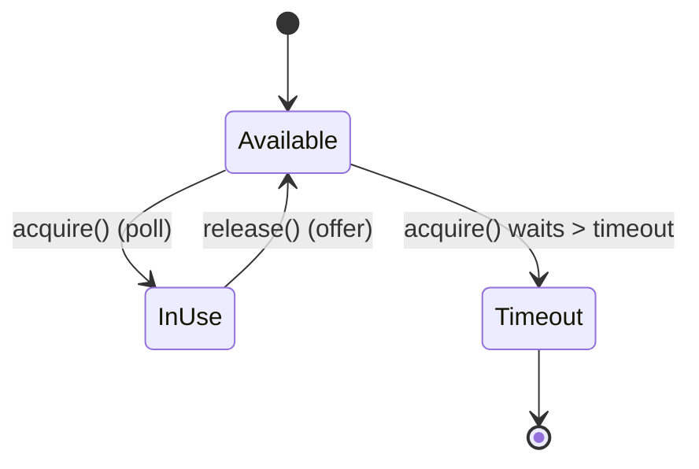

# Module 3 — SDE-3 Concurrency & State Management

Runnable code: `src/main/java/com/ultimatelld/module03concurrency/`
Run it: `./gradlew run -Pdriver=com.ultimatelld.theory.module03concurrency.driver.Driver`

This module is the toolbox the Section 2 problems draw on. Verified driver output:
```
[Singletons] holder=1, doubleChecked=1, enum=1
[ObjectPool] served=24, maxConcurrentInUse=3 (<= poolSize 3), doubleCheckout=false
[Locking] expected=160000 | optimistic=160000 (retries~383k) | pessimistic=160000
[Inventory] BROKEN sold=113 (oversold!) | FIXED sold=100, remaining=0
```

## 3.1 Thread-safe singletons

| Idiom | Mechanism | Verdict |
|-------|-----------|---------|
| **Initialization-on-demand holder** | Nested class loaded lazily; JVM guarantees thread-safe class init | ✅ Preferred — lazy, no sync, no volatile |
| **Enum** | JVM guarantees one instance; serialization/reflection-proof | ✅ Preferred — simplest |
| **Double-checked locking** | `volatile` field + `synchronized` block | ⚠️ Correct only with `volatile`; legacy ceremony |
| Eager `static final` | Instance created at class load | OK if construction is cheap and always needed |

The classic DCL bug: without `volatile`, instruction reordering can publish a *partially constructed* object — another thread sees a non-null reference to an object whose fields aren't set yet.

## 3.2 Concurrent object pool



Backed by an `ArrayBlockingQueue`: `poll` hands each element to exactly one caller, so the same resource is **never** lent twice. `acquire(timeout)` blocks when empty; exhaustion is a timeout (`null`), not an error. (A `Semaphore` + collection is the equivalent alternative — the queue bundles both concerns.)

## 3.3 Optimistic vs. Pessimistic locking (in-memory)

| | Optimistic (CAS + version) | Pessimistic (lock) |
|---|---|---|
| Mechanism | Read versioned state, CAS the new state, retry on conflict | Acquire `ReentrantLock`, mutate, release |
| Best when | Low contention, short critical section | High contention, large critical section |
| Failure mode | Retry storms under contention (we measured ~383k retries for 160k updates) | Threads block / potential deadlock with multiple locks |
| Blocking? | Non-blocking (lock-free) | Blocking |

The `version` field is the heart of optimistic concurrency: it detects "did anyone change this since I read it?" — the same idea as a SQL `WHERE version = ?` optimistic update or an HTTP ETag.

## 3.4 Lock-strategy decision matrix

| Situation | Use |
|-----------|-----|
| Single counter / flag | `AtomicInteger` / `AtomicLong` / `AtomicReference` (CAS) |
| Independent per-key state, high read concurrency | `ConcurrentHashMap` (+ `computeIfAbsent`) |
| Per-entity critical section, want fairness/tryLock/timeout | `ReentrantLock` (optionally striped per id) |
| Simple mutual exclusion, no advanced features | `synchronized` |
| Read-mostly small collection | `CopyOnWriteArrayList/Set` |
| Producer/consumer handoff | `BlockingQueue` (`ArrayBlockingQueue`, `LinkedBlockingQueue`) |
| Compound check-then-act on a number | CAS retry loop (`while(!cas(old,new))`) |

## 3.5 The oversell race (booking/inventory)

The canonical interview bug: **read → check → write** is three steps. Two threads both read stock=1, both pass `> 0`, both write 0 → two units sold from one. `BrokenInventoryService` reproduces it (sold > stock); `AtomicInventoryService` fixes it with a CAS loop so the check-and-decrement commits atomically and stock never goes negative. This exact pattern underlies Scenario A (seats) and Scenario C (spots).
