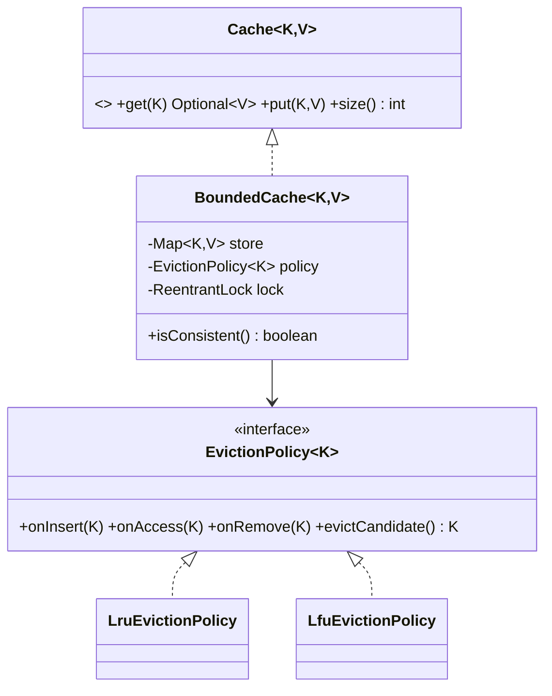

# Problem F — Thread-Safe LRU/LFU Cache

Code: `src/main/java/com/ultimatelld/problems/lrucache/`
Run: `./gradlew run -Pdriver=com.ultimatelld.problems.lrucache.driver.Driver`

## 1. Problem & SDE-3 constraints
A fixed-capacity in-memory cache with O(1) `get`/`put`, a **pluggable eviction policy**, and full
thread-safety under heavy concurrent access. Capacity must never be exceeded; the backing store and
the eviction bookkeeping must never drift out of sync. Verified: 32 threads × 20k ops on a cap-50
cache → capacity never exceeded, map and policy stay consistent.

## 2. Clarifying questions
- Eviction policy — LRU, LFU, FIFO, TTL? (Pluggable; LRU + LFU shipped.)
- Capacity by entry count or memory size?
- Concurrency level — single global lock, striping, or lock-free?
- Behavior on miss — return empty/null, or load-through from a backing source?
- Are values mutable / large (copy on read)?

## 3. Class diagram

## 4. Production skeleton notes
- **Single-lock atomicity**: `BoundedCache` owns one `ReentrantLock` guarding BOTH the map and the
  policy. The compound `read → maybe-evict → insert` is therefore atomic — the source of the
  capacity invariant and map/policy consistency. (Striping or `ConcurrentHashMap` + per-key locks
  is the scale-up; the single lock is the clear, correct baseline.)
- **OCP eviction**: `EvictionPolicy` is the strategy seam. `LruEvictionPolicy` uses a
  `LinkedHashSet` (re-insert = move to MRU tail; head = LRU victim), O(1). `LfuEvictionPolicy` keeps
  frequency buckets in a `TreeMap` with LRU tie-break. New policy = new class, cache untouched.
- **Metrics**: hits/misses/evictions as atomics for observability.

## 5. Edge cases & race analysis
- **Concurrent put at capacity** → the lock serializes evict-then-insert, so two inserts can't both
  skip eviction and overflow. Driver asserts capacity is never exceeded.
- **Map/policy drift** → impossible because both mutate under the same lock; `isConsistent()` proves
  `store.size() == policy.size()`.
- **Overwrite of existing key** → treated as an access (no eviction, no size change).
- **Scale-up** → swap the single lock for striped locks or a `ConcurrentHashMap` with an approximate
  LRU (e.g. Caffeine's TinyLFU); the `Cache`/`EvictionPolicy` interfaces stay the same.
