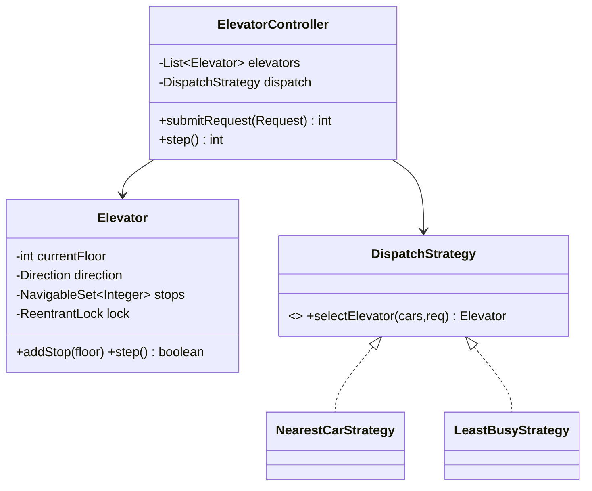
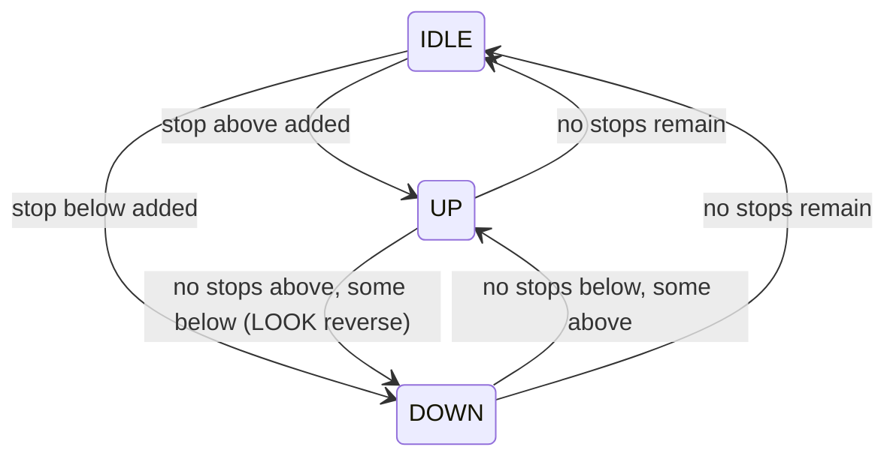

# Problem G — Elevator System

Code: `src/main/java/com/ultimatelld/problems/elevator/`
Run: `./gradlew run -Pdriver=com.ultimatelld.problems.elevator.driver.Driver`

## 1. Problem & SDE-3 constraints
Coordinate a bank of elevators serving concurrent hall calls, with a pluggable dispatch policy and
a correct per-car movement algorithm. Calls arrive from many threads at once; no call may be lost.
Verified: 40 concurrent hall calls across 3 cars → every requested floor is visited, simulation
converges, all cars end idle.

## 2. Clarifying questions
- Number of cars and floors? Express/zoned elevators?
- Dispatch goal — minimize wait time, minimize travel, or balance load?
- Movement model — SCAN/LOOK (sweep) vs. nearest-stop?
- Capacity per car / overload handling? Door-open dwell time?
- Real-time (each car a thread) or stepped simulation?

## 3. Class & state diagrams

## 4. Production skeleton notes
- **Per-car lock**: each `Elevator` guards its floor/direction/stop-set with its own `ReentrantLock`,
  so hall calls can be added from many threads while the controller advances cars. Cars are
  independently lockable, so a real deployment can run each on its own thread/timer — the stepped
  `controller.step()` here is just a deterministic simulation of that.
- **LOOK algorithm**: `nextTarget()` keeps moving in the current direction servicing stops via
  `NavigableSet.ceiling/floor`, then reverses when none remain ahead — efficient and starvation-free.
- **OCP dispatch**: `DispatchStrategy` (NearestCar, LeastBusy) decides assignment; a smarter
  wait-time/direction-aware policy is a new class.

## 5. Edge cases & race analysis
- **Concurrent calls to the same/different floors** → thread-safe `addStop`; a call for the car's
  current floor is served immediately.
- **Direction flip mid-travel** → handled by LOOK; a newly added stop behind the car is served on
  the return sweep, not by abandoning the current direction.
- **All cars busy** → calls still queue onto the chosen car's stop set; none are dropped.
- **Idle reset** → when the last stop is served, direction resets to IDLE (no stale direction).
- **Starvation** → LOOK bounds wait time; a priority/aging dispatcher would further protect
  long-waiting calls.
