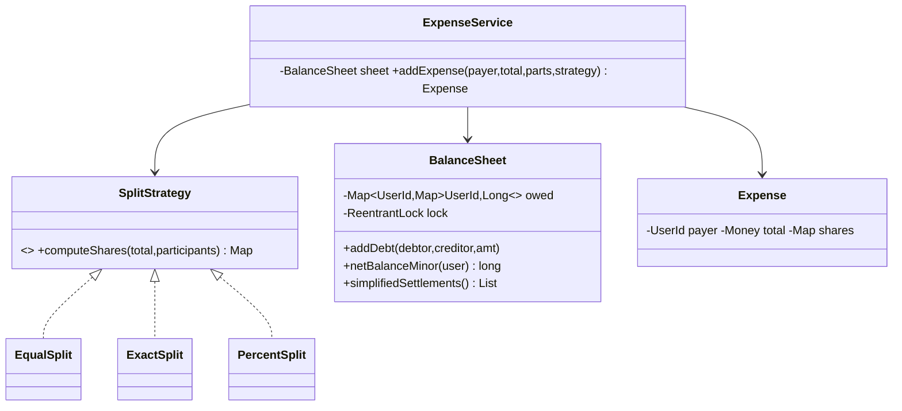

# Problem H — Splitwise (Expense Sharing)

Code: `src/main/java/com/ultimatelld/problems/splitwise/`
Run: `./gradlew run -Pdriver=com.ultimatelld.problems.splitwise.driver.Driver`

## 1. Problem & SDE-3 constraints
Track shared expenses among users, support multiple split schemes, report who owes whom, and
compute a minimal set of settlement transactions. Money must be conserved exactly (no rounding
leak) even under concurrent expense recording. Verified: balances net to zero; 16k concurrent
expenses still net to zero.

## 2. Clarifying questions
- Split types — equal, exact amounts, percentage, shares? (Equal/Exact/Percent shipped.)
- Groups vs. a single shared ledger? Multi-currency?
- Show raw pairwise debts, simplified settlements, or both? (Both.)
- How to handle rounding of indivisible cents?
- Concurrency — many users adding expenses to the same group at once?

## 3. Class diagram

## 4. Production skeleton notes
- **OCP split strategies**: `SplitStrategy` returns each participant's share; every implementation
  guarantees shares sum to the exact total. Equal/Percent distribute the flooring remainder one
  minor unit at a time so no cent is created or lost (money as `long` minor units, never `double`).
- **Self-validating `Expense`**: its constructor rejects shares that don't sum to the total — an
  invariant enforced in the entity, not the service (rich domain model).
- **Thread-safe `BalanceSheet`**: a single `ReentrantLock` makes each expense's multiple debt
  updates atomic, and nets each new debt against the reverse debt so a pair never shows mutual debt.
- **Minimum cash flow settlement**: two heaps (max-creditor, max-debtor) are greedily matched,
  producing at most (users − 1) transactions.

## 5. Edge cases & race analysis
- **Rounding** → remainder distribution keeps the sum exact; the `Expense` invariant would catch any
  strategy bug.
- **Mutual debts** → netting on write collapses "A owes B / B owes A" into one direction.
- **Self-payment / payer in participants** → the payer's own share creates no debt to themselves.
- **Concurrent expenses** → serialized by the sheet's lock; the global invariant `sum(netBalances) == 0`
  holds (driver proves it after 16k concurrent expenses).
- **Scale-up** → shard the ledger per group and persist debts; the strategy and settlement logic are
  unchanged.
