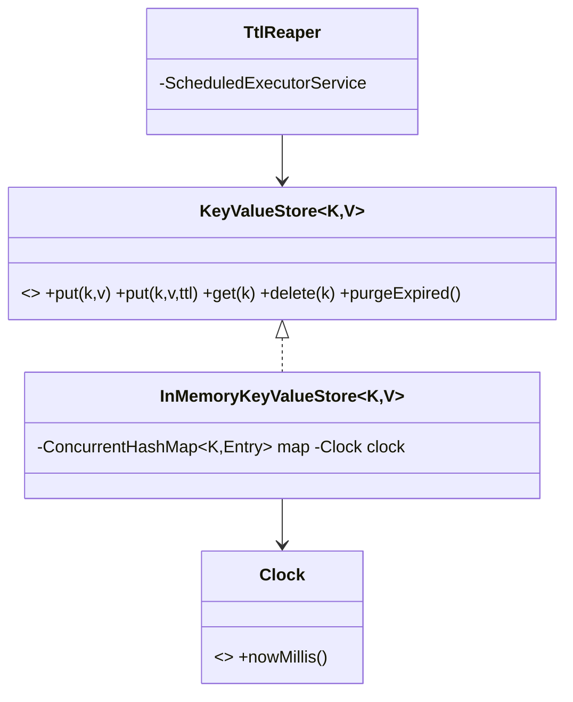

# Problem I — Key-Value Store with TTL (mini-Redis)

Code: `src/main/java/com/ultimatelld/problems/kvstore/`
Run: `./gradlew run -Pdriver=com.ultimatelld.problems.kvstore.driver.Driver`

## 1. Problem & SDE-3 constraints
A concurrent in-memory key-value store with optional per-key TTL. Reads must be correct under heavy
concurrency; expired entries must not be returned and must not leak memory. Verified: lazy expiry on
read, active purge sweep, and 960k mixed concurrent ops with zero errors.

## 2. Clarifying questions
- Expiry semantics — lazy (on access), active (background), or both? (Both.)
- Eviction under memory pressure (LRU) in addition to TTL?
- Per-key TTL or global? Update-resets-TTL?
- Consistency — last-writer-wins, or CAS/versioned ops?
- Single node or sharded/distributed?

## 3. Class diagram

## 4. Production skeleton notes
- **Hybrid expiry (Redis-style)**: `get` checks expiry and evicts lazily; `TtlReaper` (a daemon
  `ScheduledExecutorService`) calls `purgeExpired()` periodically so never-read keys don't leak.
- **Conditional removal**: lazy/active eviction uses `ConcurrentHashMap.remove(key, entry)` so a key
  concurrently overwritten with a fresh value is never wrongly deleted.
- **Injected `Clock`** makes TTL deterministic in the demo (`Clock.Manual.advanceMillis`).
- **No global lock**: `ConcurrentHashMap` gives per-bucket concurrency; operations are independent.

## 5. Edge cases & race analysis
- **Read-vs-expire race** → conditional `remove` prevents dropping a just-written entry.
- **`size()` accuracy** → may transiently include not-yet-purged expired entries (documented); a
  precise count would filter on read or rely on the reaper.
- **TTL update** → `put` with TTL overwrites the entry and its expiry.
- **Reaper shutdown** → `close()` stops the scheduler cleanly (daemon thread, no leak).
- **Scale-up** → shard by key hash across N stores; add an LRU eviction policy for memory bounds.
