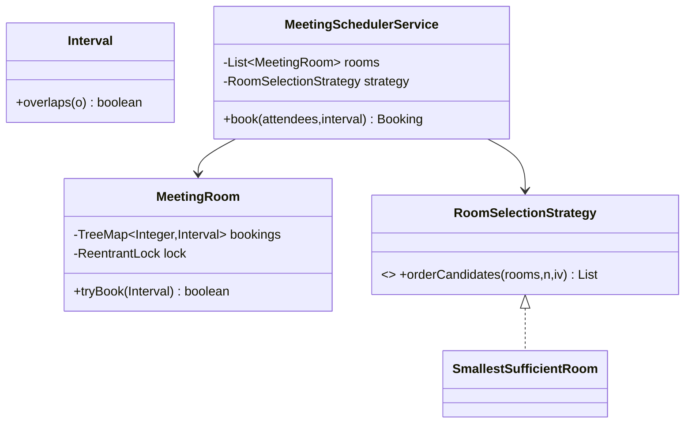

# Problem J — Meeting Room Scheduler

Code: `src/main/java/com/ultimatelld/problems/meetingscheduler/`
Run: `./gradlew run -Pdriver=com.ultimatelld.problems.meetingscheduler.driver.Driver`

## 1. Problem & SDE-3 constraints
Book rooms for time intervals with capacity constraints and conflict detection. A room must never be
double-booked for overlapping intervals, even under concurrent requests. Verified: 30 concurrent
requests for the same slot across 3 rooms → exactly 3 booked (one per room), no double-booking;
overlapping slots rejected once rooms are busy.

## 2. Clarifying questions
- Conflict definition — half-open intervals (back-to-back OK) or inclusive?
- Selection policy — first available, smallest sufficient, by floor/building?
- Recurring meetings? Cancellations and modifications?
- Capacity / equipment constraints per room?
- Concurrency — many organizers booking the same popular slot at once?

## 3. Class diagram

## 4. Production skeleton notes
- **Atomic per-room booking**: each `MeetingRoom` guards its calendar with a `ReentrantLock`, so the
  conflict check + insert is one step — two threads can't both book the same room for overlapping times.
- **O(log n) conflict check**: a `TreeMap` keyed by interval start; checking the `floor` and `ceiling`
  neighbours suffices because existing bookings are themselves non-overlapping.
- **Half-open intervals** `[start,end)` so 10–11 and 11–12 don't conflict (back-to-back meetings).
- **OCP selection**: `RoomSelectionStrategy` (SmallestSufficientRoom) decides candidate order; the
  service tries each until one accepts.

## 5. Edge cases & race analysis
- **Concurrent same-slot requests** → serialized per room; only one wins each room (driver: 3 booked / 27 rejected).
- **Containing/overlapping intervals** → floor+ceiling check catches an existing booking that spans the new one.
- **No sufficient room free** → `NoRoomAvailableException`.
- **Cancellation race** → `remove(start, interval)` is conditional, so it only removes the exact booking.
- **Scale-up** → partition rooms across nodes; persist calendars; use DB range/exclusion constraints for conflicts.
