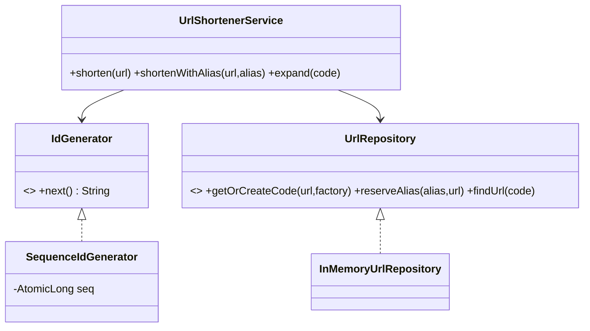

# Problem K — URL Shortener (TinyURL)

Code: `src/main/java/com/ultimatelld/problems/urlshortener/`
Run: `./gradlew run -Pdriver=com.ultimatelld.problems.urlshortener.driver.Driver`

## 1. Problem & SDE-3 constraints
Generate short codes for long URLs and resolve them back, with custom aliases. Codes must be unique
and collision-free under concurrency; shortening the same URL should be idempotent. Verified: 64k
concurrent shorten calls over 5000 distinct URLs → unique codes == distinct URLs (no collisions, no
duplicate codes for the same URL).

## 2. Clarifying questions
- Idempotent (same URL → same code) or always-new code?
- Custom aliases / vanity URLs? Expiry of links?
- Code length / charset? Estimated scale (→ id strategy)?
- Analytics on resolves? Rate limiting?
- Single node or distributed id generation?

## 3. Class diagram

## 4. Production skeleton notes
- **Collision-free ids**: `SequenceIdGenerator` is an `AtomicLong` encoded to **base-62** — every
  caller gets a distinct number, hence a distinct code, with no locking.
- **Idempotent shortening**: `getOrCreateCode` uses `ConcurrentHashMap.computeIfAbsent` (atomic per
  key), so concurrent shortenings of the same URL generate exactly one code.
- **Atomic custom alias**: `putIfAbsent` claims an alias or fails — no check-then-set race.
- **DIP**: id generation and storage are injected interfaces; swap in Snowflake ids or Redis/DB.

## 5. Edge cases & race analysis
- **Concurrent shorten of same URL** → single code via atomic `computeIfAbsent` (driver proves unique==distinct).
- **Alias collision** → `AliasAlreadyExistsException`; first claim wins.
- **Unknown code on expand** → `NoSuchElementException`.
- **Distributed id generation** → hand each node a pre-allocated counter range (or Snowflake) to stay
  collision-free without a global lock; the `IdGenerator` interface is the seam.
- **Hot links** → cache `code→url` (read-heavy); the repository interface allows a caching decorator.
