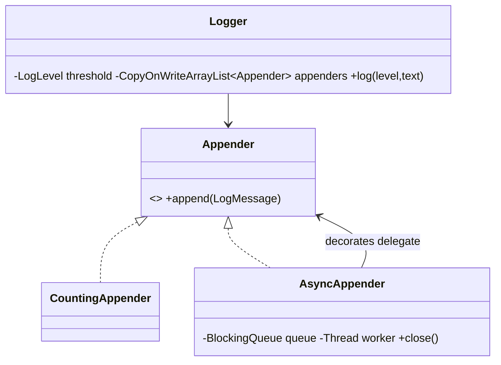

# Problem L — Logging Framework

Code: `src/main/java/com/ultimatelld/problems/logging/`
Run: `./gradlew run -Pdriver=com.ultimatelld.problems.logging.driver.Driver`

## 1. Problem & SDE-3 constraints
A logging framework with severity levels, pluggable appenders, and asynchronous delivery that loses
nothing on shutdown. Must be correct under concurrent logging from many threads. Verified: 16 threads
logging mixed levels → all DEBUG filtered, 161,760 messages delivered with zero loss across the async
flush.

## 2. Clarifying questions
- Level threshold global or per-logger/per-package?
- Appenders — console, file, network, async? Multiple at once?
- Async backpressure — drop, block, or unbounded queue?
- Ordering guarantees across threads/appenders?
- Structured logging / formatting / MDC context?

## 3. Class diagram

## 4. Production skeleton notes
- **Level filtering** in `Logger.log` — below-threshold records are dropped before any appender runs.
- **OCP + Decorator appenders**: `Appender` is the seam; `AsyncAppender` *decorates* any other
  appender, adding a `BlockingQueue` + worker so the calling thread never blocks on I/O.
- **Lossless flush**: `AsyncAppender.close()` stops accepting, lets the worker drain the remaining
  queue, then joins — no message is lost on shutdown.
- **Thread-safe config**: `CopyOnWriteArrayList` of appenders + volatile threshold allow safe
  concurrent logging and runtime reconfiguration.

## 5. Edge cases & race analysis
- **Concurrent logging** → fan-out to appenders is safe; the async queue serializes delivery on one worker.
- **Shutdown mid-flight** → drain-then-join guarantees queued messages are written (driver: 0 loss).
- **Backpressure** → unbounded queue here (no loss); a bounded queue would trade loss/blocking for memory.
- **Ordering** → per-thread order is preserved into the queue; cross-thread global order is not guaranteed.
- **Scale-up** → batch writes in the worker, add a rolling-file appender, or shard appenders per level.
