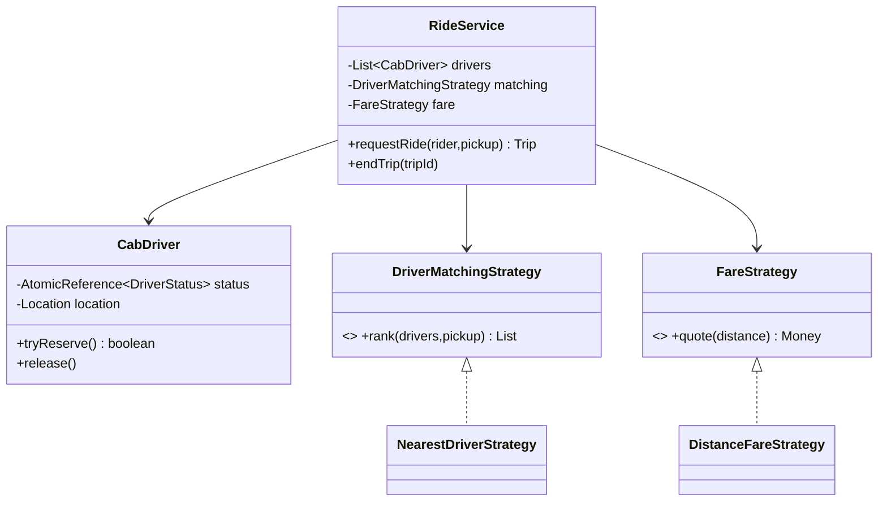

# Problem M — Cab Booking (Ride Matching)

Code: `src/main/java/com/ultimatelld/problems/cabbooking/`
Run: `./gradlew run -Pdriver=com.ultimatelld.problems.cabbooking.driver.Driver`

## 1. Problem & SDE-3 constraints
Match riders to nearby available drivers under concurrency: a driver must be assigned to at most one
rider at a time. Pluggable matching and fare policies. Verified: 20 concurrent ride requests against
5 drivers → exactly 5 matched (each a distinct driver), 15 rejected; ending a trip frees the driver
for re-matching.

## 2. Clarifying questions
- Matching goal — nearest, highest-rated, ETA, surge-aware?
- Driver acceptance step, or auto-assign? Cancellation handling?
- Fare model — base + distance, surge, time-of-day?
- Location updates / geo-indexing for "nearby" at scale?
- Concurrency — many riders near the same driver requesting at once?

## 3. Class diagram

## 4. Production skeleton notes
- **Lock-free assignment**: `CabDriver.tryReserve()` is an `AtomicReference.compareAndSet(AVAILABLE,
  ON_TRIP)`. The matching strategy only *ranks* candidates; the service walks the ranking attempting
  CAS, so concurrent riders racing for the same nearby driver resolve safely — one wins, others skip.
- **OCP strategies**: `DriverMatchingStrategy` (NearestDriver) and `FareStrategy` (DistanceFare) are
  independent plug-ins; surge pricing or ETA-based matching are new classes.
- **Money as `long` minor units** via the shared `common.Money`.

## 5. Edge cases & race analysis
- **Race for the last/nearest driver** → CAS guarantees at most one rider per driver (driver proves
  distinct-drivers == matched-count).
- **No driver available** → `NoDriverAvailableException`.
- **Trip completion** → `endTrip` releases the driver (CAS back to AVAILABLE); a new rider can match.
- **Stale ranking** → a driver reserved between ranking and CAS simply fails the CAS; the loop advances.
- **Scale-up** → replace the linear scan with a geo-index (quadtree/geohash) for "nearby"; shard drivers by region.
