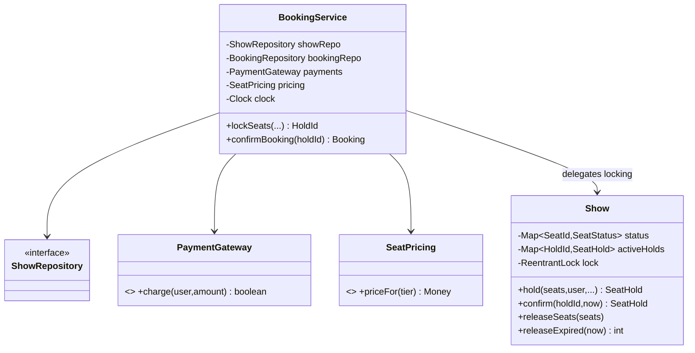
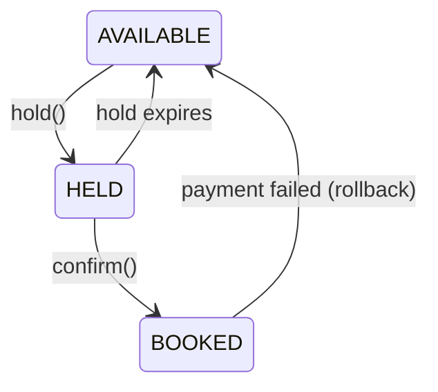

# Scenario A — Concurrent Movie Ticket Booking System

Code: `src/main/java/com/ultimatelld/scenarioa/`
Run: `./gradlew run -Pdriver=com.ultimatelld.problems.moviebooking.driver.Driver`

## 1. Problem & SDE-3 constraints
Design a system where users browse shows, select seats, and book them. At scale, thousands of users contend for the same popular seats at the exact same instant. Requirements:
- A seat must be sold **at most once** — no double-booking under any interleaving.
- Selecting seats places a **temporary hold** (e.g. while the user pays); holds **expire** so abandoned carts free their seats.
- Confirmation couples **seat allocation + payment** atomically from the user's view; a failed payment must release the seats.

## 2. Clarifying questions
- Hold duration and policy on expiry? (We use a fixed TTL + lazy reclaim + optional reaper.)
- Can a user hold seats across multiple shows? Max seats per booking?
- Is payment synchronous? What's the rollback contract if payment fails after seats are marked booked?
- Single-node in-memory or distributed? (In-memory here; distributed would push locks to Redis/DB row locks.)
- Pricing rules (tiers, dynamic)? — handled by a `SeatPricing` strategy (OCP).

## 3. Class & state diagrams

## 4. Production skeleton notes
- **`Show` is the aggregate root** for seat state. Every transition runs under the show's `ReentrantLock`, so the check-then-act ("all requested seats AVAILABLE? then mark HELD") is atomic — the source of exact-moment safety. (`Show.java`)
- **All-or-nothing holds**: a multi-seat hold either grabs every seat or none.
- **Expiry is lazy + proactive**: every entry point reclaims expired holds first; `sweepExpiredHolds()` lets a background reaper do it on a schedule. `Clock` is injected so the demo is deterministic.
- **Confirm = book then charge, with compensation**: seats flip to BOOKED atomically; if `PaymentGateway.charge` declines, seats roll back to AVAILABLE and `PaymentDeclinedException` is thrown. (`BookingService.confirmBooking`)

## 5. Edge cases & race analysis
- **Two users, same seat, same millisecond** → the lock serializes them; the second sees HELD/BOOKED and gets `SeatUnavailableException`. (Driver proves 1 win / 49 losses.)
- **Confirm vs. expiry race** → `confirm()` re-reclaims expired holds under the lock, then checks the hold still exists; a just-expired hold yields `HoldExpiredException`.
- **Payment fails after booking** → compensating `releaseSeats` returns the seats; no seat is stranded in BOOKED.
- **Partial multi-seat availability** → rejected before any seat is held (atomic check first).
- **Distributed extension** → replace the per-show `ReentrantLock` with a per-show distributed lock (Redis/Zookeeper) or DB row locks / `SELECT ... FOR UPDATE`; the rest of the design is unchanged.
