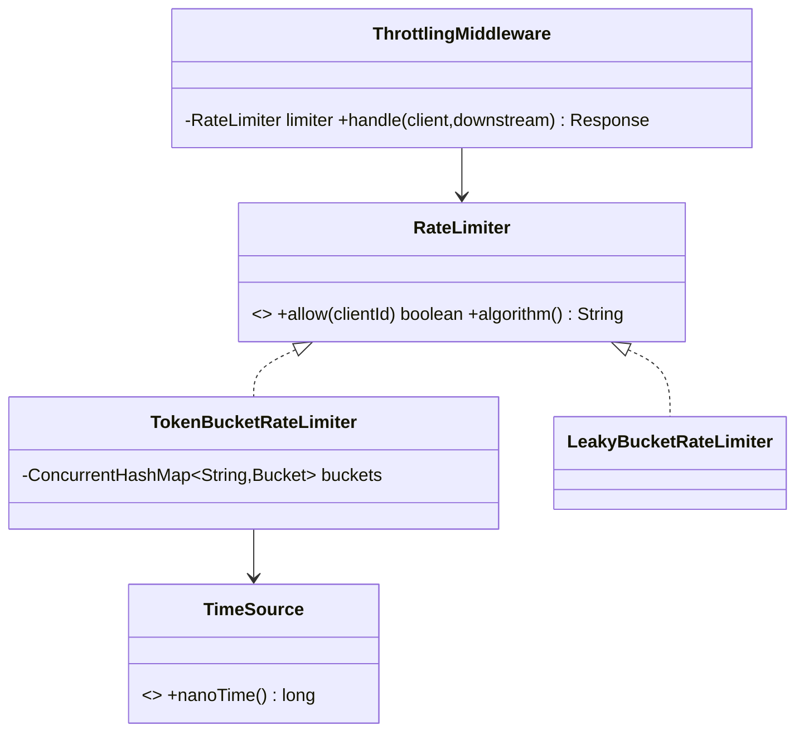

# Scenario B — Distributed Rate Limiter / Throttling Middleware

Code: `src/main/java/com/ultimatelld/problems/ratelimiter/`
Run: `./gradlew run -Pdriver=com.ultimatelld.problems.ratelimiter.driver.Driver`

## 1. Problem & SDE-3 constraints
Throttle requests per client to protect downstream services. Must be correct under heavy concurrency (counters cannot lose updates), low-overhead per call, and pluggable across algorithms. Verified: an instantaneous burst of 50 from one client with capacity 10 → exactly 10 allowed, 40 throttled; after 1s of refill at 5/s → 5 more allowed; a different client is unaffected.

## 2. Clarifying questions
- Per-client, per-API, or global limits? (Per-client here; key can be `client:route`.)
- Hard limit or burst-tolerant? (Token bucket allows bursts up to capacity; leaky bucket smooths.)
- Single node or distributed? (In-memory here; distributed → shared counters in Redis.)
- Behavior when over limit — reject (429) or queue/delay?
- Is wall-clock skew across nodes a concern?

## 3. Class diagram

## 4. Production skeleton notes
- **`RateLimiter` is the OCP seam** — token bucket, leaky bucket, sliding window are interchangeable implementations; callers and the middleware don't change.
- **Lazy refill**: tokens are recomputed from elapsed time on each call (`tokens += elapsedNanos * rate`), so there's **no background refill thread**.
- **Per-client isolation**: `ConcurrentHashMap<String,Bucket>` with `computeIfAbsent`; each bucket carries its own `ReentrantLock`, so different clients never contend and same-client calls are serialized (no token double-spend).
- **Injected `TimeSource`** makes refill deterministic in tests (`ManualTimeSource.advance`).
- **`ThrottlingMiddleware`** is a facade returning a 200/429 `Response`, hiding buckets from callers.

| Algorithm | Burst behavior | Memory | Notes |
|-----------|----------------|--------|-------|
| Token bucket | Allows bursts up to capacity | O(1)/client | Most common; what we default to |
| Leaky bucket | Smooths to constant outflow | O(1)/client | Good for steady downstream |
| Sliding window counter | Precise rolling window | O(window)/client | Heavier; avoids fixed-window edge spikes |

## 5. Edge cases
- **Race on refill/consume** → guarded by the per-bucket lock; the read-refill-decrement is atomic.
- **Clock skew (distributed)** → use a monotonic source per node and tolerate small drift; for shared limits push counters to Redis with server-side time.
- **Thundering herd at window boundary** → token bucket avoids the fixed-window double-burst problem because refill is continuous.
- **Cold client** → first call lazily creates a full bucket (capacity tokens).
- **Distributed extension** → replace the in-memory bucket with a Redis `INCR`/Lua-script token bucket; the `RateLimiter` interface stays identical.
