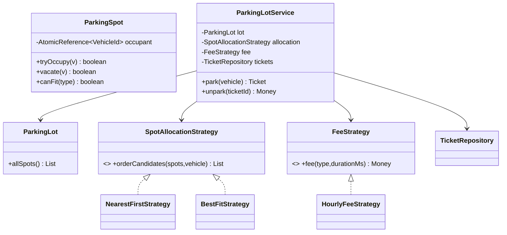

# Scenario C — High-Throughput Parking Lot System

Code: `src/main/java/com/ultimatelld/scenarioc/`
Run: `./gradlew run -Pdriver=com.ultimatelld.problems.parkinglot.driver.Driver`

## 1. Problem & SDE-3 constraints
Model a multi-floor lot supporting multiple vehicle types, with pluggable spot-allocation and fee policies, processing concurrent entries/exits. Two vehicles must never receive the same spot. Verified: 20 cars racing for 5 car-compatible spots → exactly 5 park on 5 distinct spots, 15 rejected; a truck is correctly turned away when all LARGE spots are taken, then parks once one frees.

## 2. Clarifying questions
- Vehicle types and which spot sizes each fits? (MOTORCYCLE→any, CAR→MEDIUM/LARGE, TRUCK→LARGE.)
- Allocation policy — nearest, best-fit, balanced across floors?
- Fee model — hourly, tiered, daily cap? Free grace period?
- Single entrance/exit or many (affects contention)?
- Persistence/restart requirements? (In-memory here.)

## 3. Class diagram

## 4. Production skeleton notes
- **Lock-free claim**: `ParkingSpot.tryOccupy` is an `AtomicReference.compareAndSet(null, vehicle)`. The allocation strategy only *orders* candidates; the service walks the order attempting CAS. First CAS wins; a loser simply tries the next candidate. No global lock, high throughput.
- **OCP everywhere**: `SpotAllocationStrategy` (NearestFirst, BestFit) and `FeeStrategy` (Hourly) are plug-ins — a new policy is a new class, zero edits to `ParkingLotService`.
- **Fit rules live in the type model**: `VehicleType.allowedSizes()` + `SpotSize.fits()` — adding an ELECTRIC type or a new size is local.
- **`Ticket`** carries vehicle type + entry time so exit fee needs nothing else; `Clock` injected for deterministic fees.

## 5. Edge cases & race analysis
- **Race for the last spot** → both threads CAS the same spot; exactly one succeeds, the other advances. Driver proves distinct-spots == parked-count (no double allocation).
- **Oversized vehicle / lot full for a type** → no fitting free spot ⇒ `ParkingFullException` (truck when LARGE exhausted).
- **Concurrent unpark/park of the same spot** → `vacate(vehicleId)` only clears if that vehicle still holds it; the freed spot is immediately reusable (driver shows a new car reusing a freed MEDIUM).
- **Fault isolation** → a failed park for one vehicle never corrupts others; spot state is per-spot atomic.
- **Distributed extension** → spots become DB rows; CAS becomes a conditional `UPDATE ... WHERE occupant IS NULL`.
