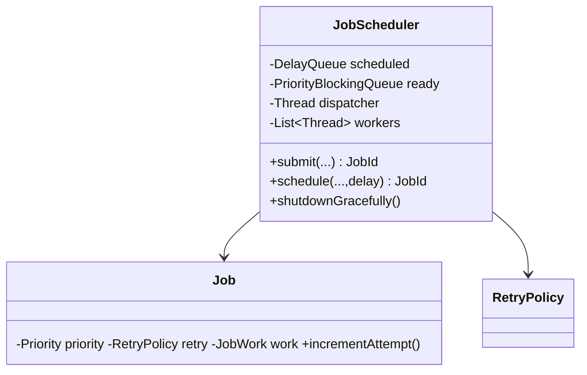
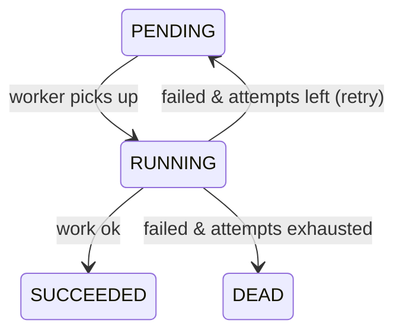

# Scenario D — Task Scheduler / Job Queue System

Code: `src/main/java/com/ultimatelld/scenariod/`
Run: `./gradlew run -Pdriver=com.ultimatelld.problems.taskscheduler.driver.Driver`

## 1. Problem & SDE-3 constraints
A multi-threaded scheduler that runs jobs with **priority** ordering, **delayed** execution, **retries** with a dead-letter, and **graceful shutdown**. A throwing job must never kill its worker. Verified: high-priority jobs run before low; a delayed job fires after ~200ms; a flaky job succeeds on attempt 3; a poison job lands in the dead-letter; a 4-worker pool completes 100 jobs and shuts down cleanly.

## 2. Clarifying questions
- Priority levels and starvation policy for low-priority jobs?
- Delay semantics — fixed delay, fixed rate, or cron?
- Retry policy — fixed count, backoff, jitter? Dead-letter handling?
- At-least-once or at-most-once execution? Idempotency of jobs?
- Shutdown: drain in-flight (graceful) vs. cancel (forced)?

## 3. Class & lifecycle diagrams

## 4. Production skeleton notes
- **Two queues + dispatcher**: a `DelayQueue` releases time-scheduled jobs only when due; a single dispatcher thread moves them into a `PriorityBlockingQueue` (the ready queue). N workers pull from the ready queue. Comparator = priority weight, then FIFO `seq` (ties run in submission order).
- **Failure isolation**: `runWithRetry` catches everything; on failure it either re-queues (attempts remain) or routes to the dead-letter — the worker thread keeps running.
- **Counters** (`completed/failed/retried`) are atomics; `executionOrder` and `deadLetter` are `CopyOnWriteArrayList`.
- **Graceful shutdown**: stop accepting, spin until `outstanding == 0` (every job terminal), then flip `running=false`, interrupt, and join all threads. Workers use `poll(timeout)` so they notice the flag.

## 5. Edge cases
- **Starvation** → strict priority can starve LOW jobs; mitigate with aging (bump priority by wait time) or weighted fair queues. (Noted as the key trade-off.)
- **Delay accuracy** → `DelayQueue` uses `System.nanoTime`; sub-ms precision isn't guaranteed (observed 203ms for a 200ms target).
- **Poison jobs** → bounded retries + dead-letter prevent infinite requeue loops.
- **Worker death** → exceptions are caught, so workers don't die; an unchecked `Error` would still need supervision.
- **Forced vs graceful** → `shutdownGracefully` drains; a forced variant would `interrupt` immediately and discard the ready queue.
