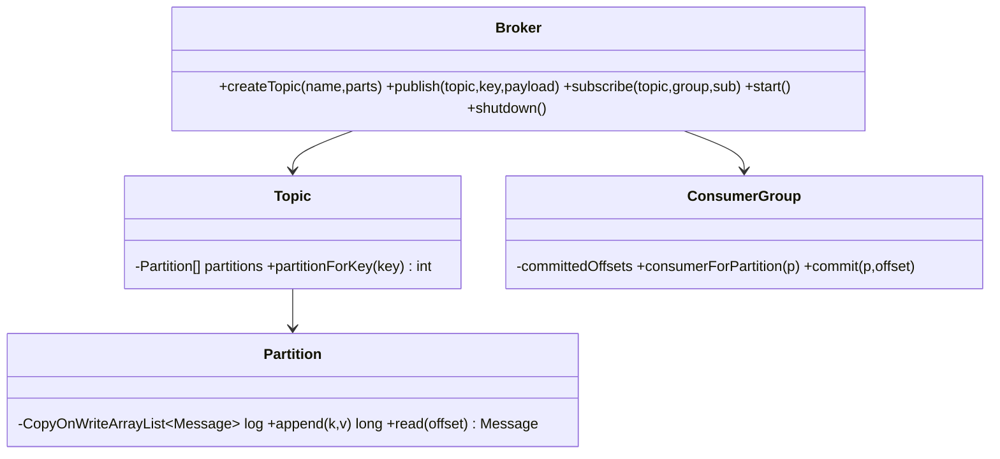
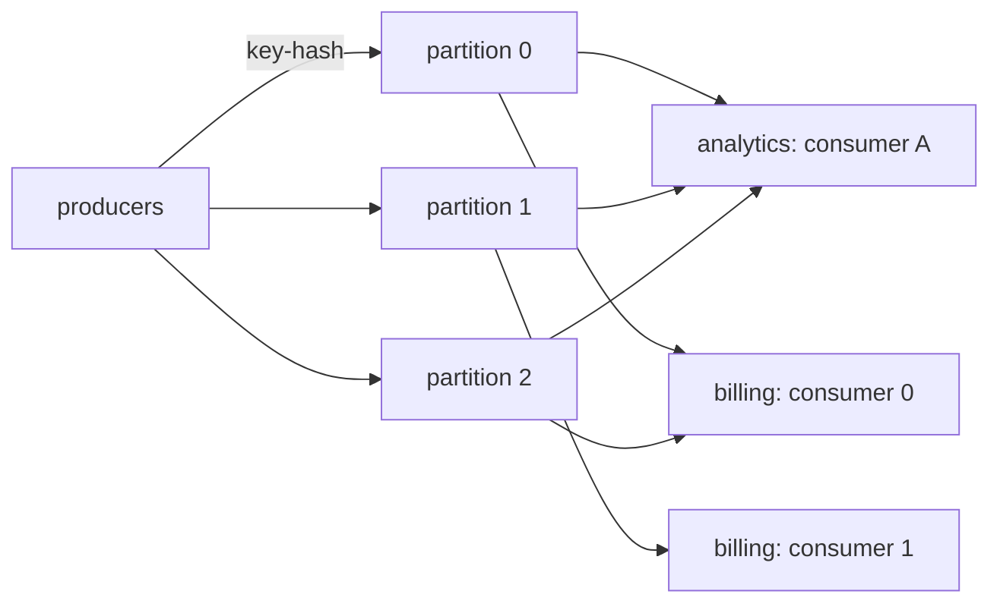

# Scenario E — In-Memory Pub-Sub Messaging System

Code: `src/main/java/com/ultimatelld/problems/pubsub/`
Run: `./gradlew run -Pdriver=com.ultimatelld.problems.pubsub.driver.Driver`

## 1. Problem & SDE-3 constraints
A Kafka-lite in-memory broker: topics split into **partitions**, **consumer groups** with per-partition **offsets**, multi-threaded delivery, and ordering guarantees. Verified: 300 messages from 6 concurrent producers → the `analytics` group (1 consumer) receives all 300 (fan-out); the `billing` group (2 consumers) splits them 240/60 across partitions; **zero ordering violations**; committed offsets sum to 300.

## 2. Clarifying questions
- Delivery guarantee: at-most-once, at-least-once, or exactly-once?
- Ordering scope — global, per-partition, or per-key? (Per-key via partitioning here.)
- Push or pull consumers? Offset commit — auto or manual?
- Rebalancing on consumer join/leave? Retention policy?
- Backpressure for slow consumers?

## 3. Architecture

## 4. Production skeleton notes
- **Partitioning by key**: `floorMod(key.hashCode(), n)` → same key always lands in the same partition, which is what preserves per-key ordering. Appends are `synchronized` for gap-free offsets; reads are lock-free over a `CopyOnWriteArrayList`.
- **One delivery thread per (group, partition)**: it reads from the group's committed offset, delivers to the assigned consumer, and **commits only after the handler returns** → at-least-once.
- **Fan-out vs. load-balance**: distinct groups each get every message (independent offsets); within a group, partition `p` is owned by consumer `p % consumerCount`, so each message is handled once per group.
- **Graceful shutdown** drains and joins all delivery threads.

## 5. Edge cases & guarantees
- **At-least-once vs at-most-once** → commit-after-handle gives at-least-once (a crash between handle and commit redelivers). Commit-before-handle would give at-most-once (possible loss). Exactly-once needs idempotent consumers or transactional offset+result commit.
- **Slow consumer / lag** → one slow partition-consumer only delays its own partition; offset = its committed position measures lag.
- **Ordering** → guaranteed per partition (single owner thread), hence per key; **not** guaranteed across partitions.
- **Rebalancing** → assignment here is fixed at `start()`; production needs dynamic reassignment when consumers join/leave (and offset fencing to avoid double-processing).
- **Duplicates** → at-least-once implies consumers must be idempotent (dedupe by key/offset).
